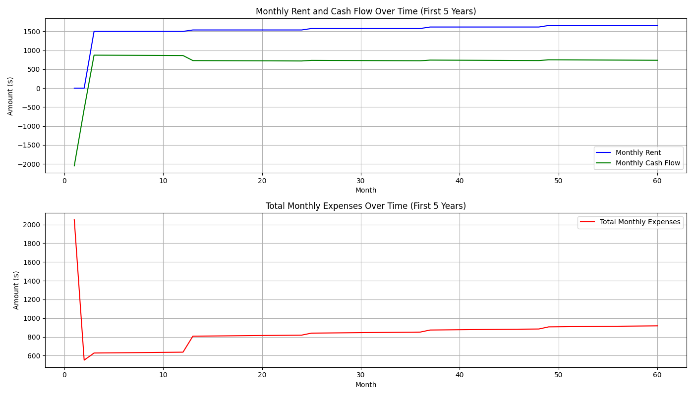
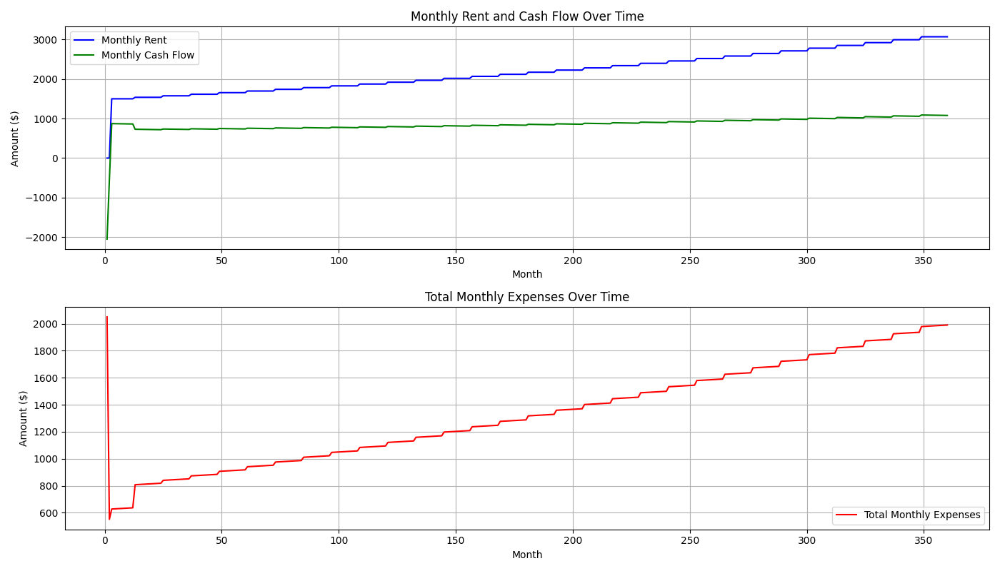
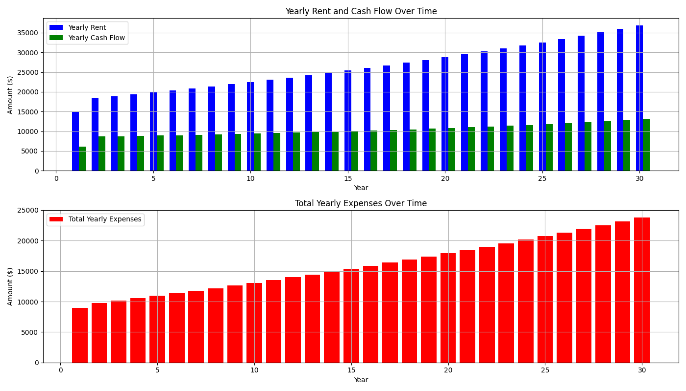

## Financial Overview

Analyzing the property's financials over 30 years provides a comprehensive look at potential profitability and risks. Here's a breakdown:

1. **Rental Income Growth**: The rental income starts at approximately $12,833 in Year 1 and rises to about $31,515 by Year 30. This reflects a healthy increase, vital for offsetting inflation and increasing expenses.

2. **Total Expenses**: Notably, Year 1 features zero costs for property management, indicating a potential introductory offer or initial self-management. Afterwards, property management incurs costs each year, starting at $1,578 in Year 2. Insurance costs also increase yearly, from $500 in Year 1 to around $1,559 by Year 30, reflecting typical market trends and potential inflation adjustments.

3. **Vacancy Costs and Repairs**: Both vacancy costs and repair expenditures see a steady rise, paralleling the rental income trend. This suggests realistic assumptions about maintenance and tenant turnover.

4. **Mortgage Expenses**: The mortgage remains fixed at about $8,792 annually, most likely due to a fixed-rate mortgage. This stability can offset the variability in other expenses but still imposes a significant financial load relative to initial rental income levels.

## Cash Flow Analysis

The most crucial data for potential investors is cash flow:

- **Negative Cash Flow First Half**: The property operates at a negative cash flow from Year 1 (-$3,964) through Year 10 (-$124). This period poses a risk unless the owner can handle the operational deficit, likely through external income or savings.

- **Transition to Positive Cash Flow**: From Year 11 onward, the property begins generating positive cash flow, starting at $81 and increasing to approximately $5,017 by Year 30. This turnaround marks the point where rental income growth surpasses expense increases.

## Key Insights and Risks

1. **Introductory Offer Implication**:
   - The absence of property management costs in Year 1 might indicate an initial offer or the owner handling these duties initially, transitioning to a management service in Year 2. This could be a strategic opportunity to reduce costs early on.

2. **Increasing Expenses Risk**:
   - Though rental income rises, so do expenses, notably repairs, capex, and insurance. Owners must prepare for potential unanticipated cost peaks, especially as properties age.

3. **Cash Flow Risks**:
   - A prolonged negative cash flow period requires careful liquidity management. Investors must ensure sufficient cash reserves or alternative income streams for the first decade.

4. **Long-term Profitability**:
   - Despite negative cash flow in the initial years, the positive trend beyond Year 11 suggests the property can be a sound investment, assuming the owner navigates early challenges effectively.

## Conclusion

The data presents a property investment with a growth-oriented rental strategy but initial cash flow challenges. Strategic budgeting for the first ten years and leveraging any introductory management offers are critical for long-term profitability. The outlined risks emphasize the importance of reserve funds and robust financial planning. By Year 30, ongoing growth in rental income and positive cash flow underscore substantial profit potential.

Below is a chart showing the evolution of the monthly rent, monthly cash flow and monthly expenses for the first 5 years of ownership

Below is a chart showing the evolution of the monthly rent, monthly cash flow and monthly expenses throughout the ownership tenure

Below is a chart showing the evolution of annual rent, cash flow and expenses throughout the ownership tenure

