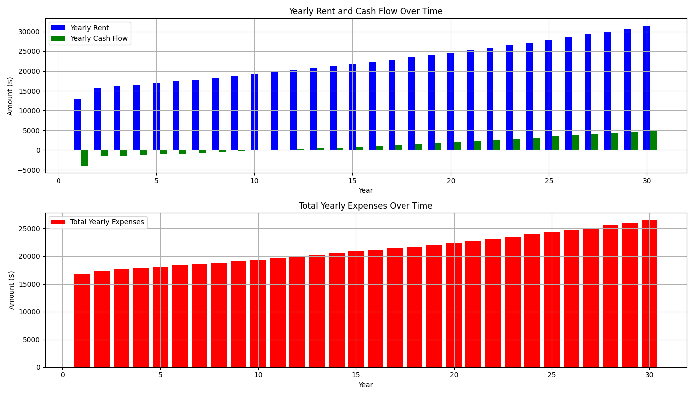

## Summary of Financial Performance

The property ownership tenure spans 30 years, during which the rental income gradually increases from $13,890 in Year 1 to $34,109.52 in Year 30. The expenses consistently exceed the income in the initial years, leading to negative cash flows until Year 14, resulting in a positive cash flow of $24.14 in Year 15, marking a significant break-even point.

## Income & Cash Flow Trajectory

- **Rental Income Growth**: Rental income exhibits a steady annual increment, starting at $13,890 and reaching $34,109.52 across the 30-year period. This growth is crucial for optimizing the return on investment.
- **Cash Flow**: The cash flow transitions from negative ($3,397.13 in Year 1) to positive figures beginning from Year 15. By Year 30, the cash flow reaches its peak at $2,449.82.

## Expense and Cost Insights

## General Expense Overview

- **Mortgage**: Remains constant at approximately $8,792.03 annually throughout the tenure, constituting a significant portion of the property expenses.
- **Expenses**: The total expenses generally increase from $17,287.13 in Year 1 to $31,659.70 in Year 30, due to rising costs in Repairs, Capex, Property Management, and increasing Insurance premiums.

## Specific Expense Details

- **Vacancy and Repairs**: Both maintain a proportional relation to rental income, causing their values to increase annually alongside income.
- **Taxes**: Increase each year in line with rental income growth, impacting the overall expense heavily.

## Discount and Offers

- **Property Management in Year 1**: Marked at $0, which suggests a promotional relief or exemption for the first year. It implies potential cost-cutting in initial ownership, though regular costs resume from Year 2 onwards, impacting expenses significantly.

## Risk Assessment

## Initial Negative Cash Flow

- **Significant Initial Risk**: The primary risk is associated with the negative cash flow in the first 14 years, exacerbating the financial burden on the property owner due to the annual excess of expenses over rental income.
  
## Long-term Stability

- **Gradual Improvement**: A decisive improvement in cash flow is observed post-Year 15, offering a better financial cushion and reducing risks in subsequent years.

## Recommendations

- **Long-term Viability**: Given the turn to positive cash flow after 15 years and increasing rental income, the investment holds strong potential for long-term benefits.
- **Early Years Management**: Strategies to manage or minimize early years' vacancies and repairs could help mitigate initial financial strains.
- **Monitor Expense Growth**: Keeping a close eye on growing categories like Taxes and Property Management will be vital to further optimize net profit over the course of ownership.

In conclusion, while the initial investment phase presents challenges due to high expense outflows, the long-term prospectus is favorable with consistent income growth and eventual positive cash flows. Managing initial years' expenses and leveraging potential cost-saving offers strategically could enhance the overall profitability of the property.

Below is a chart showing the evolution of the monthly rent, monthly cash flow and monthly expenses for the first 5 years of ownership

Below is a chart showing the evolution of the monthly rent, monthly cash flow and monthly expenses throughout the ownership tenure

Below is a chart showing the evolution of annual rent, cash flow and expenses throughout the ownership tenure

