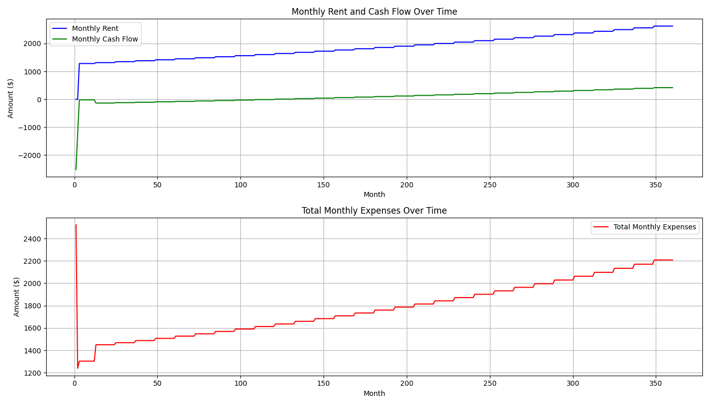

## Analysis of Rental Property Financial Data

## Key Observations

## Rental Income Growth
The rental income grows from $13,716.67 in Year 1 to $33,683.87 in Year 30, which indicates a steady increase in rental income over the years. 

## Expenses Composition and Trends
- **Vacancy Costs** steadily increase from $685.83 in Year 1 to $1,684.19 in Year 30, in line with rental income.
- **Repairs and Capex Costs** follow a similar trend, rising jointly from $1,646 each in Year 1 to $3,368.39 each in Year 30.
- **Taxes** also increase annually from $2,500 in Year 1 to $5,116.02 in Year 30.
- **Property Management Fee** is $0 in Year 1, indicating a possible promotional offer or discount especially intended to attract new property owners. From Year 2, this fee asserts itself as a recurring cost, starting at $1,687.15 and growing steadily to $3,368.39 in Year 30.
- **Insurance** experiences gradual increases as well, from $500 in Year 1 to $1,559.33 in Year 30.
- **One-time Expenses** of $1,371.67 occur only in Year 1, possibly reflecting initial setup or legal costs.

## Mortgage and Cash Flow Analysis
- The mortgage remains constant at $8,792.03 annually, affecting cash flow dynamics significantly considering it is the largest single cost item.
- Year 1 exhibits a significant negative cash flow of -$3,502.86, primarily due to the initial expenses and the free property management offer, which reduces ongoing management cost.
- Subsequent years show a trend towards improved cash flow, with a positive shift beginning in Year 17 ($60.94) and ending Year 30 with $2,173.14.

## Risks and Opportunities

## Risks
1. **Initial Losses:** The early years demonstrate substantial negative cash flows, which suggests carries a risk of liquidity challenges unless offset by reserves or alternative financing.
2. **Growing Expense Burden:** As expected, expenses grow with rental income, but they represent a significant proportion of total outflow and potentially erode profitability if income growth stagnates.
3. **Mortgage Consistency:** The unchanging mortgage cost implies that entering into a long-term fixed mortgage arrangement early may limit financial flexibility.

## Opportunities
1. **Rental Income Potential:** The consistent growth in income suggests substantial upward potential in ROI as rental demand increases.
2. **Year 1 Management Discount:** The absence of property management fees in the first year offers a unique opportunity to reduce short-term expenditures and potentially reinvest saved costs into other property enhancements.
3. **Improved Cash Flow Trajectory:** The transition into positive cash flows from Year 17 onward highlights operational efficiency improvements and profitability over the long term.

## Conclusion

This 30-year analysis provides a clear trajectory for expected gains and losses over the life of property ownership. Insight into waived fees in Year 1 shows thoughtful marketing from property management, yet early financial pressures highlight an imperative for robust cash reserves. Despite initial financial burdens, the long-term outlook predicts profitability, making continuous ownership potentially lucrative, especially post-mortgage payoff.

Below is a chart showing the evolution of the monthly rent, monthly cash flow and monthly expenses for the first 5 years of ownership

Below is a chart showing the evolution of the monthly rent, monthly cash flow and monthly expenses throughout the ownership tenure

Below is a chart showing the evolution of annual rent, cash flow and expenses throughout the ownership tenure

