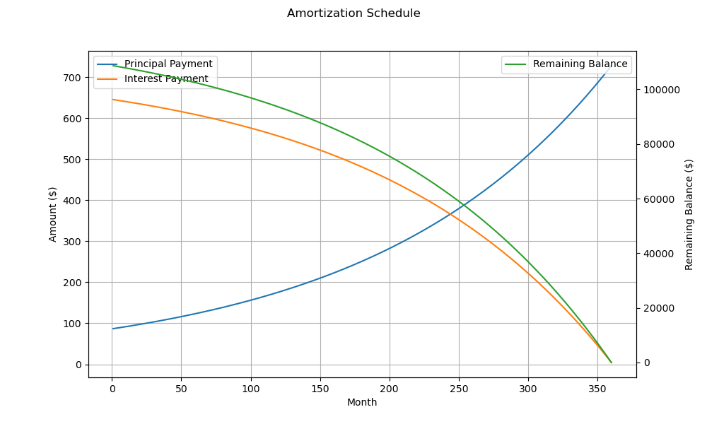

## Mortgage Amortization Analysis

The mortgage amortization structure provided in the data spans over 360 months (30 years), indicating a typical long-term fixed-rate mortgage setup. Let's delve into some crucial metrics and the changing patterns observed throughout the amortization period. 

## Key Metrics Across the Months

- **Monthly Payment**: The monthly payment remains constant at $732.67 across all 360 months. This is consistent with a fixed-rate mortgage where the total payment is steady despite the changing portions of principal and interest.

- **Principal Payment**: The initial payments are heavily interest-focused. In the first month, the principal portion is only $86.97, while the interest is much higher at $645.70. Over time, the principal payment gradually increases, which is a characteristic of how amortization schedules function. For instance, by month 60, the principal component rises to $123.32, gradually reducing the loan balance more significantly. By the final month (360), the entire principal is paid at $728.34, leaving the balance effectively at zero.

- **Interest Payment**: Correspondingly, the interest payment starts high and diminishes over time. By month 60, the interest component reduces to $609.35 from the initial $645.70 in month 1. By the last payment in the 360th month, the interest paid drops to a mere $4.32. This pattern showcases the declining interest charges as the principal is progressively paid off.

- **Remaining Balance**: The starting balance is over $108,663.03. It shows a consistent decline, reaching approximately $102,503.68 by the 60th month. This gradual reduction continues as the principal payments increase, concluding in full repayment by month 360 when the remaining balance hits $0.

## Assessment and Risks

1. **Cash Flow Management**: The fixed monthly payment provides a stable cash flow requirement, which is easier for budgeting over time. However, the investor must ensure contingency for the initial high-interest burden (e.g., $645.70 in month 1).

2. **Interest Burden**: The structure highlights significant initial interest costs, especially within the first few years. High up-front interest can impact cash flow negatively in the short term. 

3. **Principal Build-up**: Gradual increase in principal payments builds equity slowly in the early years, which is typical of fixed-rate loans. Equity build-up is crucial for financial security and possibly leveraging property for other investments.

4. **Market Interest Rate**: While this fixed-rate setup protects against rising interest rates, an investor could miss out on benefits if market rates significantly decline, which may warrant a refinancing decision.

5. **Prepayment Opportunities**: No data was provided on penalties or options for additional principal prepayments. Investors might consider this if income allows, to reduce the total interest paid over the loan's life.

## Conclusion

This amortization schedule represents a typical fixed-rate mortgage, beneficial in providing predictable monthly obligations. Early-stage high interest warrants a proper cash management strategy to mitigate its impacts on investment returns. Any decisions around refinancing or prepayment will depend on the investor’s broader financial strategy and market conditions, factors this analysis only touches upon lightly.

As you convert this to a PDF for the investor, a chart visualizing the balance reduction, principal increase, and interest decline can provide an intuitive comprehension of the amortization dynamics, aiding in more informed investment decisions.

Below is a chart showing the evolution of the remaining principal, paid interest and remaining balance throughout the mortgage period

