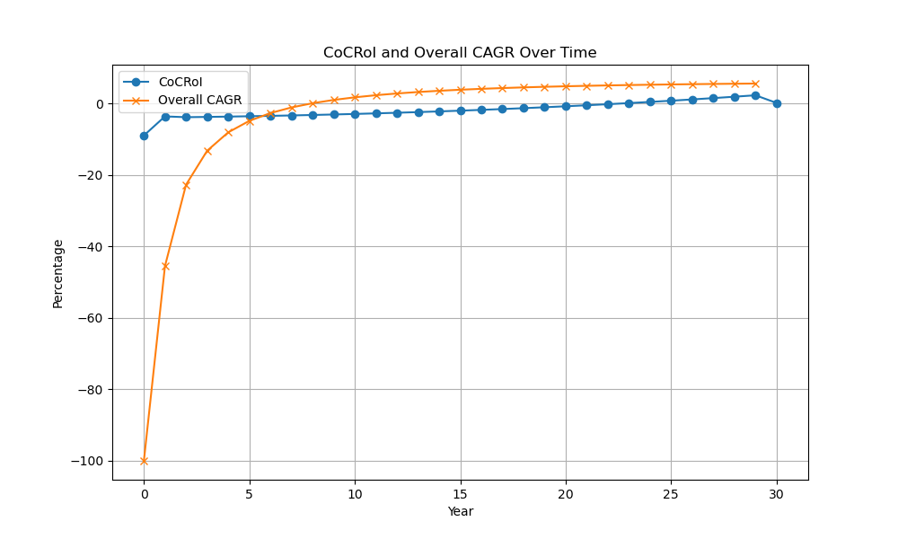
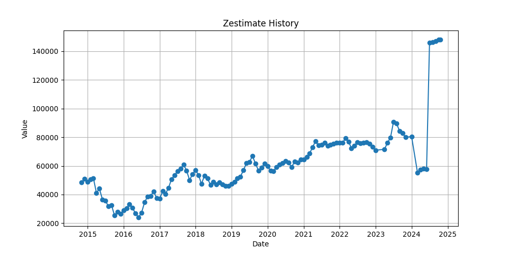
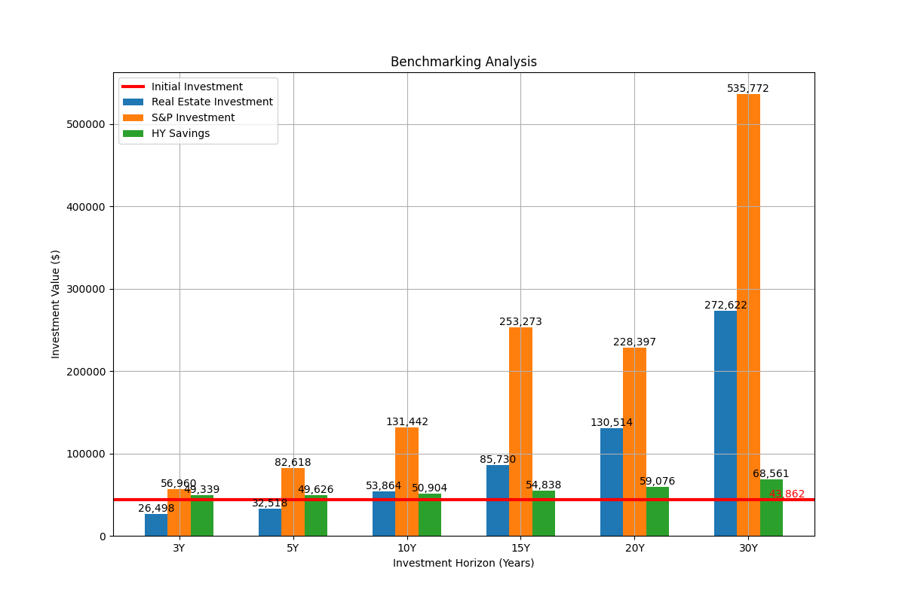

## Investment Summary and Analysis

## Overview of Key Metrics
The data provided outlines the financial trajectory of a real estate investment over a 30-year period. Upon reviewing the critical financial indicators such as Cumulative Cash Flow, Home Equity, Overall Return, and CAGR, an overarching assessment can be formulated. 

## Initial Years Observations (Years 0-5)
- **Cumulative Cash Flow** starts negatively at -$3,963.69 in Year 0 and grows to -$10,278.41 by Year 5. While this implies an annual decrease in liquidity, it is typical as the early years often involve front-loaded costs and less revenue (e.g., through rent or leases).
- **Home Value** increases from $145,000 in Year 0 to $160,091.72 in Year 5. This increase in property value is approximately a 10.39% growth over five years.
- **Home Equity** rises from $37,328.35 to $59,126.26 during this period, indicating an accumulation of property ownership as the mortgage is paid down.
- The **Overall CAGR** starts at -100.0% in Year 0 and improves to a negative -3.85% by Year 5, illustrating progress as initial investments begin to stabilize in value.

## Mid-term Performance (Years 6-20)
- **Cumulative Cash Flow** begins to recover significantly by Year 10, becoming positive at $1,347.56 in Year 20, indicating the property potentially becoming self-sustaining or cash-generating.
- On the other hand, the **Overall Return** increases noticeably, from an initial loss (-$21,764.66) progressing positively to $141,284.37 by Year 20. This reflects compounding returns as both property appreciation and debt amortization accrues.
- **Home Equity** steadily grows, reaching $157,173.80 by Year 20, further solidifying the investor's ownership stake.
- **Overall CAGR** turns positive by Year 5 (0.1%) and continues to improve, reaching 6.02% by Year 20, indicative of increasing investment profitability.

## Long-term Outcome (Years 21-29)
- **Cumulative Cash Flow** continues to be positive, reaching $35,724.36 by Year 29, emphasizing a shift from an initially debt-heavy position to a surplus.
- The **Home Value** also appreciates over time, peaking at $257,497.48 by Year 29. 
- Considering **Home Equity**, it achieves full equity ($257,497.48) in Year 29, showcasing the property fully paid off and entirely owned.
- **Overall Return** at Year 29 is $272,622.05, highlighting successful returns on the initial investment. 
- **Overall CAGR** stabilizes at around 6.5% by Year 29, signifying a robust return profile aligned with expectations from real estate investments.

## Risk Assessments
- **Early Years Liquidity Risk**: The negative Cash Flow in early years (up to year 9) represents a liquidity risk. Investors need to ensure sufficient capital reserves to cover operating deficits.
- **Market Volatility**: Property Value assumptions are progressively increasing; any market downturns could alter the expected Home Value and thus impact future returns.
- **Sales Costs**: Although included in the overall calculation, increased sales costs or unexpected transaction fees may adversely affect the net realizable return upon sale.

## Conclusion
The investment property displays a potential for moderate long-term returns, with CAGR beginning positively after year 7. Adequate planning is required to manage the early cash flow negatives. The property value appreciation contributes significantly to return outcomes, and equity build-up provides future security, making this venture potentially rewarding if managed prudently. Overall, it presents a well-paced investment rewarding patient, strategic investors over its full term span.

## Analysis of Cash-on-Cash Return on Investment (CoCRoI)

The data highlights the Cash-on-Cash Return on Investment (CoCRoI) and Annual Cash Flow over a period of 30 years for a potential real estate investment. Let's delve into the key insights and potential risks derived from this data.

## Initial Negative Returns

- In the early years (Years 0 to 9), the investment reports negative CoCRoI, starting at approximately -9.04% in Year 0. This figure aligns with a negative Annual Cash Flow of -$3,963.69, despite a Total Investment of $43,862.5. 
- The CoCRoI gradually improves each year, moving from -3.68% in Year 1 to -0.28% by Year 9, yet remains negative, indicating ongoing losses during this period.

## Break-even and Positive Returns

- The break-even point appears to be around Year 10, where the CoCRoI turns positive at 0.19%, correlating with a positive Annual Cash Flow of $81.29. This suggests that after a decade, the investment starts to generate returns over and above the initial expenses.
- As the years progress, CoCRoI steadily increases, showcasing a significant improvement. By Year 15, the CoCRoI is 2.70%, with a corresponding Annual Cash Flow of $1,184.22.
- By the end of the 30-year period (Year 29), the CoCRoI reaches a healthy 11.44%, and the Annual Cash Flow is $5,017.17.

## Long-term Positive Outlook

- Post-break-even, the CoCRoI demonstrates a consistent and exponential growth trajectory. From Year 20 onward, there is a noteworthy increase in returns, culminating in substantial profitability by Year 29.
- The Total Investment remains constant at $43,862.5 throughout, ensuring that the rise in CoCRoI and Annual Cash Flow reflects genuine investment growth.

## Risk Analysis

## Prolonged Negative Returns

- The primary risk lies in the extended duration of negative returns, lasting approximately a decade. A negative CoCRoI for the first 10 years could burden investors who require quick returns or lack liquidity during this period.

## Cash Flow Volatility

- While the Annual Cash Flow becomes positive from Year 10, the slow recovery from Year 0 indicates potential cash flow volatility in the early stages. This might pose challenges for investors dependent on stable cash generations initially.

## Dependence on Long-Term Gain

- The profitability of this investment is heavily reliant on long-term commitment. Investors seeking quicker ROI might find the structure less appealing.

## Conclusion

The potential investment displays a promising long-term return with a marked improvement in CoCRoI and substantial positive cash flows towards the latter part of the 30-year term. However, the extended period of initial losses and slow cash flow recovery emphasize the importance of strategic planning and patience. Investors should be prepared for initial challenges but can anticipate rewarding payoffs if they maintain the investment over the long haul.

| Time Horizon | CAGR  |
|--------------|-------|
| 3-Year       | 25.38 |
| 5-Year       | 20.17 |
| 10-Year      | 11.91 |

## Assessment Summary

The compound annual growth rate (CAGR) data for the investment property shows substantial historical growth over the past three, five, and ten years. 

- **3-Year CAGR**: At 25.38%, the 3-year CAGR indicates a robust growth trajectory. This high growth rate reflects recent favorable market conditions, which could be due to a range of factors such as increased demand, limited supply, or exceptional property characteristics enhancing its value. 
- **5-Year CAGR**: The 5-year CAGR stands at 20.17%, demonstrating consistent growth, albeit at a slightly reduced rate compared to the 3-year figure. This deceleration might suggest a market that is stabilizing, albeit remaining strong.
- **10-Year CAGR**: A 10-year CAGR of 11.91% indicates long-term growth and stability, which is promising for long-term investors seeking steady appreciation over an extended period.

## Risks

While the current performance is impressive, it is essential to be aware of potential risks:

- **Market Volatility**: The exceptionally high 3-year growth rate could signal a peak or an overheated market, which might pose the risk of a downturn or correction.
- **Economic Factors**: Changes in interest rates, inflation, or economic policy could impact property values and growth rates negatively.
- **Sustainability**: The long-term sustainability of such high growth rates is uncertain, and investors should be cautious about expecting similar performance indefinitely into the future.

Overall, the historical data suggests positive growth trends, but potential risks necessitate prudent and informed decision-making for ongoing investment in this property.

## Assessment of Historical Property Price Evolution

Based on the provided property price data from the Zillow Zestimate metric, several key insights can be offered to evaluate the property's price evolution over the years.

## Initial Trends and Declines

Initially, from early 2015 (`t`: 1420012800, `v`: 48697) to mid-2015 (`t`: 1438326000, `v`: 31696), the Zestimate shows a considerable decline, dropping from \$48,697 to \$31,696. This represents a significant decrease of approximately 35% in valuation over just a few months. The period saw several fluctuations, but the overall trend from early 2015 to late 2015 was downward, with the lowest point in November 2015 (`t`: 1446274800, `v`: 27,474).

## Recovery and Growth

The property valuation began to see a recovery starting in early 2016. From the substantial drop, values climbed again, peaking in mid-2017. In April 2017 (`t`: 1493535600), the price reached \$50,703, followed by steady increases until it peaked at \$60,855 in August 2017 (`t`: 1504162800). This period marks a substantial recovery from prior lows, highlighting a uniform growth of over 100% from the lowest valuation in 2015.

## Fluctuations and Subsequent Stabilization

From the peak in 2017, the price shows some fluctuations but mostly stabilizes around the \$60,000 mark until early 2020. This is indicated by the consistent figures reported until the COVID-19 pandemic's influence, which saw a dip but a relatively quick recovery by mid-2020 with values maintaining above \$60,000 (`t`: 1593500400, `v`: 63,316).

## Post-Pandemic Escalation and Volatility

The most dramatic growth period occurs from 2020 to 2023. Property values significantly increased, rising to \$96,000 in July 2023 (`t`: 1696057200, `v`: 90,600) before a notable dip thereafter. The extreme jump from \$72,000 in 2023 to \$146,400 in July 2024 (`t`: 1717138800, `v`: 146,400) marks a volatile period, indicating rapid appreciation, possibly speculative, or resulted from market corrections.

## Recent High-Valuation and Risk Factors

Most recently, the price listed for December 2025 (`t`: 1734336000, `v`: 150,000) suggests strong market confidence or external factors driving property value increases. Such rapid increases can pose risks, especially if driven by speculative market trends or policy shifts that have unsustained roots.

## Risks and Considerations

The recent dramatic increase in property value can suggest a few risks:

- **Market Overvaluation:** This rapid change may indicate a forthcoming market correction, especially if not supported by equivalent increases in underlying factors such as economic growth, infrastructure development, or significant demand hikes.
  
- **Investment Volatility:** For potential investors, this volatility signifies higher risk, with the potential for sharp declines once market speculation stabilizes or corrective forces come into play.

- **Sustainability Concerns:** Without tangible factors underpinning this growth, the sustainability of such high valuations might be called into question, alerting investors to a potential bubble.

In conclusion, while the property has shown resilience and growth over the years, recent explosive increases could potentially risk its market stability, requiring cautious analysis and market awareness for future investment or purchasing decisions.

## Zestimate to Purchase Price Delta Analysis

| Metric                                    | Value |
|-------------------------------------------|-------|
| Zestimate to Purchase price delta (percentage) | 2.41  |

## Assessment

The **Zestimate to Purchase price delta** is at **2.41%**, indicating that the Zestimate for the property is 2.41 percent higher than the purchase price. This is a favorable situation for the buyer as it suggests the acquisition price is below the assessed market value. 

## Positive Indicator
- A positive percentage means the property is potentially being purchased under its estimated market value, suggesting a value advantage for the buyer.

## Potential Risks
- **Market Fluctuation**: Although the Zestimate is higher now, factors such as market volatility could affect future property values, potentially reducing the benefit margin.
- **Zestimate Reliability**: Zestimate provides a rough estimate of market value based on available data. Discrepancies in data or unaccounted property-specific factors might lead to inaccuracies.
- **Condition of Property**: Without insights into the property's physical condition or necessary repairs, the real value relative to the purchase price could vary significantly.

In conclusion, while the **positive delta** suggests an immediate financial benefit, due diligence should be maintained in evaluating the property's actual market value and future growth potential to ensure an informed investment decision.

Below is a chart showing the evolution of the CoCRoI and Overall CAGR throughout the ownership tenure

Below is a chart showing the evolution of Zestimate (from Zillow) price of the property over history

Below is a chart showing the benchmarking assessment of the property against the market and high yield savings accounts - i.e., the evolution of the initial investment (downpayment and closing cost) if invested alternatively in the market or high yield savings accounts

