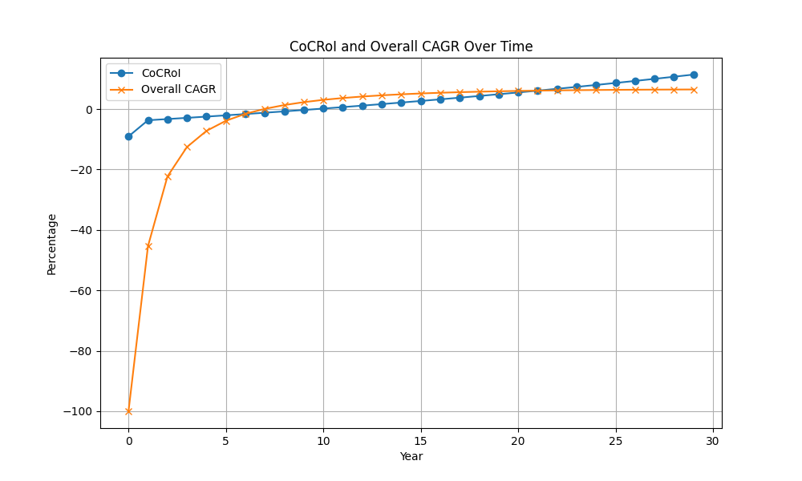

## Investment Property Analysis

## Overall CAGR Evaluation

Analyzing the data for each year:

- **Initial Loss**: In Year 0, the overall CAGR is -100.0% due to an initial negative cash flow of -$3,571.99 and a total investment of $43,862.5. The property begins with a home value of $145,000, but the overall return is $22,156.36.
- **Improving Trends**: By Year 6, the overall CAGR improves significantly to -1.22%. The cumulative cash flow reaches -$10,161.71 with a home value increase to $163,293.55 and an increase in home equity to $63,979.57. The overall return climbs to $40,754.38.
- **Positive Growth**: Positive growth is achieved starting in Year 7, with an overall CAGR of 0.25%. This is characterized by cumulative cash flow reducing to -$11,056.75 as cash flow increases, home value rises to $166,559.42, home equity to $69,018.51, and an overall return of $44,637.00.
- **Consistent Growth Uptrend**: By Year 20, the property demonstrates a more stable growth, with a CAGR of 5.40% as the home value appreciates to $215,462.37, and the home equity reaches $157,173.80. The cumulative cash flow improves to -$14,335.07, indicating recovering cash flow conditions.
- **Steady Returns at Maturity**: At Year 29, the overall CAGR stabilizes at 5.94%, with overall returns of $233,879.11, cumulative cash flow at -$3,018.57, and home equity and value both peaking as the debt reduces.

## Overall Return Assessment

- **Initial Negative Return**: In Year 0, the overall return is $22,156.36, lower than the initial investment due to the high cost of sales ($11,600).
- **Steady Increase in Home Equity**: Throughout the 30 years, home equity increases substantially from $37,328.35 in Year 0 to $257,497.48 in Year 29, indicating effective long-term appreciation and mortgage repayment success.
- **Sales Costs Impact**: Sales costs increase annually, reaching $20,599.80 by Year 29, though they are outweighed by home value appreciation.
- **Positive Return Outlook**: The overall returns indicate strong potential for realizing profits when considering property appreciation and improving cash flow trends.

## Risk Factors

- **Initial Losses**: High negative cash flow in early years may indicate risk for investors who require early yield.
- **Slow Positive Cash Flow**: Notably, positive annual cash flow does not emerge until Year 17, which could be a concern for investors focused on immediate cash flow.
- **Sales Costs Accumulation**: The escalating sales cost might reduce net gains if the property is sold before maturity (Year 29).

## Conclusion

Overall, this investment property offers moderate long-term appreciation potential as demonstrated by the steady increase in CAGR from negative to over 5.9%. However, initial years present cash flow challenges as returns take time to grow measurably positive. Investors need to be prepared for initial losses and delays in positive cash flow but can expect substantial home equity and returns if held long-term.

## Analysis of Cash-on-Cash Return on Investment (CoCRoI)

The analysis of the CoCRoI over the 30-year period illustrates an initially challenging financial landscape, but shows signs of improvement over time.

## Initial Investment Concerns

- **Year 0** starts with a CoCRoI of -8.20%, which is notably adverse, paired with an **Annual Cash Flow** of -$3,597.57, reflecting the immediate financial obligation of the initial **Total Investment** of $43,862.5.
- The negative CoCRoI continues through **Year 16**, with the least negative performance recorded at -0.18% (Year 16) compared to the lesser magnitude of negative cash flow at -$79.76.

## Transition to Positive Returns

- At **Year 17**, the investment begins to yield positive returns with a CoCRoI of 0.09% and an Annual Cash Flow of $39.30. This marks a turning point, indicating that the property starts to overcome its initial financial burdens.
- Moving forward, the CoCRoI steadily climbs, reaching impressive levels such as 4.50% in **Year 29**, with an Annual Cash Flow of $1,975.50, suggesting robust financial health in the later stages.

## Positive Trends and Risks

- The CoCRoI continues on an upward trend past Year 18, peaking at 4.50% in Year 29, with a handsome annual cash flow. However, the sudden drop to a CoCRoI of 0.37% in **Year 30**, with Annual Cash Flow drastically reducing to $160.52, suggests potential variability in returns that could be indicative of market changes or unforeseen costs.

## Investment Risks

- The severely negative returns from **Year 0 to Year 16** might deter risk-averse investors, as the lack of positive cash flow during these years implies a commitment to sustain those losses through margin financing or other capital supplementation.
- The consistent negative returns could stress liquidity and financial flexibility during the early years, a risk that requires careful cash management and planning.

## Conclusion

Overall, while this property requires a considerable upfront investment that doesn’t yield positive returns until Year 17, it eventually matures into a financially viable asset demonstrating strong future value potential. Investors should be prepared for prolonged negative cash flow periods and should possess a strong financial capability and risk tolerance to support this investment until it turns profitable. Adequate assessment of market conditions and future cash flow projections are crucial for ensuring sustained profitability and managing potential year-over-year variability as observed in Year 30's data.

```markdown
## CAGR Analysis Table

| Time Horizon | CAGR   |
|--------------|--------|
| 3-Year       | 24.79% |
| 5-Year       | 19.83% |
| 10-Year      | 11.75% |

## Summary of Assessment

The historical Compound Annual Growth Rate (CAGR) for the investment property shows significant growth over varying time horizons. 

- **3-Year CAGR**: The recent 3-year CAGR is exceptionally high at **24.79%**, indicating strong short-term growth. This may reflect a period of rapid appreciation, possibly driven by current market trends, improvements in the property, or developments in the surrounding area.

- **5-Year CAGR**: Over a 5-year horizon, the CAGR is **19.83%**, still substantial but lower than the 3-year rate. This suggests that while growth has been strong, it has moderated slightly over a more extended period. This could be indicative of earlier market conditions or the property's maturity in its current growth stage.

- **10-Year CAGR**: In the long term, the CAGR stands at **11.75%**. This is a sustainable growth rate over a decade, showing consistent value appreciation. However, it also illustrates that recent years have experienced increased growth rates compared to earlier years.

## Risks and Considerations

- **Sustainability of Growth**: The very high 3-year CAGR of **24.79%** may not be sustainable indefinitely. Such rapid growth often attracts more competition, market corrections, or regulatory intervention, which may slow future appreciation.

- **Market Volatility**: The difference between the 3-year and 10-year CAGRs (24.79% vs 11.75%) could indicate market volatility. Stakeholders should carefully analyze if the recent uptrend is due to temporary factors or fundamental improvements.

- **Economic Factors**: External factors such as interest rate changes, economic downturns, or regional developments may impact future growth.

It is crucial to continuously monitor market conditions and property performance to gauge if adjustments to the investment strategy are necessary to mitigate potential risks. A diversified investment approach may also help manage the risk associated with such growth rates.
```

## Historical Price Evolution

The property's Zestimate data reveals varying degrees of price volatility over the years. During December 2014, the property was valued at approximately $50,850 (timestamp `1417334400`). By February 2015, the value decreased slightly to $48,697 (timestamp `1420012800`). 

From there, the next few years saw considerable fluctuations. In April 2015, the value rebounded to $51,444 (timestamp `1425110400`), but then it took a sharp drop to $41,105 by March 2016 (timestamp `1459407600`). Subsequently, the valuation showed further decline reaching $24,206 in June 2016 (timestamp `1464678000`).

By the end of 2016, the property value began to recover, reaching $38,743 in November (timestamp `1475218800`). The upward trend continued into 2017, with the property peaking at $60,855 by August (timestamp `1504162800`).

The property value then experienced another downturn in late 2017 and early 2018, dropping to $47,287 by March 2018 (timestamp `1522479600`). Thereafter, there was a significant rebound, reaching another peak at $62,891 in July 2019 (timestamp `1564556400`).

The valuation remained relatively stable with minor fluctuations until November 2020, when it was recorded at $64,320 (timestamp `1606723200`). Another significant increase was noted during 2021, peaking at $77,187 in April (timestamp `1619766000`).

Recent data from 2023 shows another dramatic increase, reaching a peak of $148,400 by November (timestamp `1730358000`). This substantial leap from the previous months is worth mentioning as it indicates either a significant market shift or an error in the valuation model.

## Risks

1. **Market Volatility**: The data reveals significant fluctuations in the property's value over the years, which suggests market instability. This is evidenced by dramatic falls, such as from $60,855 in August 2017 to $50,064 in November 2017 (timestamp `1509433200`), and unusual spikes as seen in 2023.

2. **Recent Valuation Variability**: Recent jumps in the property's value, from $80,500 in January 2023 (timestamp `1704009600`) to $148,400 in November 2023 (timestamp `1730358000`), may indicate hyperinflation of local prices or potential inaccuracies in valuation algorithms.

3. **Sustainability of Increases**: The sizeable recent increase needs further analysis to determine if these changes are sustainable or if they result from temporary market conditions or anomalies.

## Conclusion

Overall, while the property has displayed considerable appreciation over the decade, market volatility poses a significant risk. Potential investors should conduct further due diligence to understand the factors contributing to these fluctuations, especially recent price surges, and assess the potential for future price stability.

## Zestimate to Purchase Price Analysis

| Metric                                | Value |
|---------------------------------------|-------|
| Zestimate to Purchase price delta (percentage) | 2.00  |

## Summary

The **Zestimate to Purchase price delta** is 2.00%, which indicates that the Zestimate valuation is 2% higher than the actual purchase price. This suggests that you are acquiring the property at a price slightly below its estimated market value, which could be considered favorable for the buyer. The positive figure indicates a purchasing advantage, as the property seems to be undervalued based on Zestimate.

## Risks

Despite the favorable purchasing condition based on the current analysis, there are some potential risks to be aware of:

1. **Accuracy of Zestimate**: The Zestimate is an estimated valuation that can sometimes fluctuate due to market regulation changes, recent sales in the area, or updates in property characteristics. Therefore, relying solely on the Zestimate may pose a risk if these factors are not accurately accounted for.

2. **Market Volatility**: Given economic fluctuations, property values can change rapidly. A 2% undervaluation is relatively modest, and any downturn in the housing market could quickly negate this benefit.

3. **Condition of the Property**: If the property requires significant repairs or updates that were not factored into the purchase price, the anticipated financial advantage might be offset.

By considering these risks, you can better assess the opportunity and make a more informed purchasing decision.


Below is a chart showing the evolution of the CoCRoI and Overall CAGR throughout the ownership tenure




Below is a chart showing the evolution of Zestimate (from Zillow) price of the property over history


