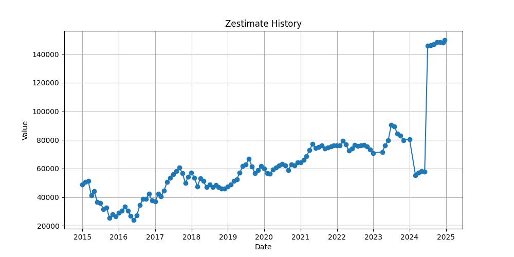

## Investment Summary and Risks

## Overall CAGR and Return
The data indicates that the Compound Annual Growth Rate (CAGR) of the investment property starts negatively and becomes positive over time. Initially, in Year 0, the **Overall CAGR** is -100.0%, indicating a large upfront investment characterized by negative cash flow and the initial costs not producing positive returns. However, as the years progress, the CAGR improves significantly and first turns positive by Year 7 with a CAGR of **0.8506%**. By the end of Year 29, the CAGR reaches **6.0909%**, which signifies a satisfactory long-term appreciation and positive return on investment. This demonstrates the tendency of real estate investments to improve over a more extended period as property values appreciate and equity builds up through mortgage payments.

Moreover, the **Overall Return** reflects the cumulative benefit gained when considering both capital appreciation and net cash flow after costs. In Year 0, the **Overall Return** is **$22,331.23**, climbing to **$243,647.02** by Year 29. The growth trend in property valuation is evidenced by the increase in the **Home Value** from **$145,000** at Year 0 to **$257,497.48** by Year 29. Concurrently, the **Home Equity** surpasses the **Home Value** by Year 29, amounting to approximately **$257,497.48** due to both appreciation and loan principle being paid down.

## Risks and Considerations
1. **Negative Initial Returns and Cash Flow**: The early years show a negative **Cumulative Annual Cash Flow**. By Year 0, it is **-$3,397.13**, increasing negatively to **-$11,119.37** by Year 13. These negative cash flows indicate the property is a financial burden initially, and an investor would need additional cash reserves or additional income sources until the cash flows stabilize.

2. **Sales Cost Impact**: The **Sales Cost** increases annually, starting at **$11,600** in Year 0 and reaching **$20,599.80** by Year 29. This must be factored into profitability as transactions can be costly when liquidating or selling the property.

3. **Changing Market Conditions**: If property prices or rental income scenarios were to fluctuate unfavorably, this could affect both **Home Value** appreciation and cash flow projections. Economic or unanticipated market downturns can have a significant adversarial effect on real estate investments.

## Final Assessment
Based on the data trajectory, this real estate investment appears viable primarily over the long-term horizon. The initially negative returns and capital requirements suggest the necessity for a patient investment strategy and the capability to withstand early financial pressure. Importantly, the positive CAGR from Year 7 onward along with cumulative cash flows transitioning to positive after Year 26 indicates eventual financial benefit. 

Investors considering such a property should ensure they have adequate capital to manage negative cash flow early in the investment term, while also taking into account potential market volatility and exit costs.

## Assessment of CoCRoI for the Investment Property

The attached data set outlines the Cash on Cash Return on Investment (CoCRoI), Annual Cash Flow, and Total Investment amount during a 30-year period. Let's analyze these crucial data points to derive insights regarding the potential investment property.

## Initial Years Performance

The initial years showcase a negative CoCRoI, beginning with -7.85% in Year 0 and gradually improving but still remaining negative until Year 13, where it stands at -0.21%. During these early years, the Annual Cash Flow remains negative as well, starting at -$3,444 for Year 0 and progressing upward to -$94 by Year 13.

These results highlight a considerable deficit in the initial cash flow, which suggests an extended period before the property starts generating positive returns. This is a significant risk, as the long span of negative cash flow may require external funding or reserves to manage operating expenses.

## Transition to Positive Returns

Year 14 marks a pivotal shift where the CoCRoI becomes positive at 0.03%, increasing incrementally each year to reach 5.54% by Year 29. The Annual Cash Flow makes a parallel transition, beginning with a modest $14 in Year 14 and culminating at $2,432 by Year 29.

This trend presents a positive outlook, indicating that, although the property took nearly 14 years to surpass investment costs, the latter years portray a promising return trajectory. This is ideal for investors with the flexibility to withstand initial losses for potential long-term gains.

## Anomaly in Year 30

A noteworthy anomaly appears in Year 30, with a sudden drop in CoCRoI to 0.45% from 5.54% in Year 29, and Annual Cash Flow dipping significantly to $199 from $2,432. This sudden change might be driven by unforeseen large expenses or culminations of wear-and-tear on the property impacting revenue or requiring considerable investment to maintain attractiveness to tenants.

## Conclusion

The overall assessment reveals a property that requires patience and potentially additional funds to cover deficits during the early years. However, persistence pays off with significant improvements in return in the mid-to-long term. The investment begins to yield more than 5% CoCRoI from Year 28, which is attractive for steady long-term returns. 

However, potential investors need to account for the anomaly noted in Year 30 and strategize accordingly to address potential risks of sudden cost spikes. Engaging in thorough due diligence, preparing for budget overruns, and planning for maintenance costs would mitigate some of the notable risks identified in the property investment timeline.

## Table of CAGR

| Time Horizon | CAGR  |
|--------------|-------|
| 3-Year       | 24.88% |
| 5-Year       | 19.88% |
| 10-Year      | 11.77% |

## Assessment Summary

Analyzing the data, we can see that the compound annual growth rate (CAGR) over different time horizons reflects an overall positive growth pattern for the investment property. 

- **3-Year CAGR:** At 24.88%, the recent short-term growth is quite robust. This indicates a strong demand or favorable market conditions in the last three years. However, such high growth rates can sometimes signal a possibility of overheating in the market, potentially making the current prices unsustainable in the long run.

- **5-Year CAGR:** The 5-Year CAGR of 19.88% shows a slightly moderated yet still strong growth when compared to the 3-Year CAGR, suggesting sustained growth over the medium term. This continued positive trend is encouraging for investors seeking medium-term investments.

- **10-Year CAGR:** The 10-Year CAGR of 11.77% provides a more normalized view of the property's long-term performance. This growth rate is healthy and indicates steady appreciation over a decade, reassuring long-term investors of the investment’s stability and resilience.

## Risks
1. **Sustainability of High Growth Rates:** The high short-term growth rate at 24.88% might not be sustainable. Investors should be cautious of potential market corrections or adjustments, which could arise if the growth rate is driven by temporary factors.

2. **Market Volatility:** Given the difference in growth rates between the 3-Year and 10-Year brackets, there could be periods of high volatility or shifts in market sentiment that investors should be prepared to manage.

3. **External Economic Factors:** As always, real estate investments are subject to broader economic conditions—interest rate changes, inflation, or policy changes could significantly affect future growth prospects.

In conclusion, while the investment property has demonstrated impressive growth over recent years, potential risks should be carefully considered, especially for those with short-term investment strategies. Further analysis into market conditions and factors driving the growth could provide deeper insights into the sustainability of these trends.

## Property Price Evolution Summary

The historical data of the property's Zestimate shows distinct trends over time. It is important to break down the data into identifiable periods to highlight key observations and trends.

1. **Initial Observation (Dec 2014 - Jun 2015):**
   - The property value decreased from $50,850 in December 2014 to $35,727 by June 2015. This period experienced a sharp decline, losing approximately 29.7% of its value within these six months.

2. **Volatile Phase (Jul 2015 - Dec 2015):**
   - Between July 2015 and December 2015, the property value fluctuated and overall declined to $26,587 by December 2015. There was a brief recovery between October 2015 to November 2015, only to dip again.

3. **Gradual Recovery (Jan 2016 - Oct 2017):**
   - Beginning January 2016 with a value of $29,074, the property experienced a gradual increase, peaking at $60,855 by September 2017. This recovery phase marks a significant increase of almost 109% over the period.

4. **Mild Decline and Stabilization (Nov 2017 - Jan 2020):**
   - Post peak in September 2017, the property value saw oscillations, declining to $59,863 by December 2019. The fluctuations stabilized towards the end of this period.

5. **COVID-19 Pandemic Impact and Recovery (Feb 2020 - Jan 2021):**
   - Initially, there was a mild decrease during the early 2020s, reaching a low of $56,554 in February 2020. The value then started recovering and went up to $66,141 by January 2021, showing resilience during the pandemic.

6. **Significant Growth and Subsequent Correction (Feb 2021 - May 2023):**
   - A sharp increase was observed from $66,141 in January 2021 to $90,600 by July 2023. However, a correction phase followed, dropping to $76,100 by May 2023.

7. **Recent Peak and Fluctuation (Jun 2023 - Present):**
   - Another peak was noted in August 2023 at $90,600, followed by a noticeable drop to $79,900 by November 2023.

8. **Projected Future Volatility:**
   - Projections for late 2023 indicate estimations with endpoints of $80,500 in December 2023 to an eventual sharp increase to $148,200 by January 2025, indicating expected volatility or data anomalies in projections as actual market dynamics at play may vary.

## Risks Identified

- **High Volatility:** The historical data illustrates significant fluctuations in property value, with periods of both sharp declines and rapid increases indicating market instability.
  
- **Market Anomalies:** The sudden drop from $79,900 in November 2023 to projected $55,300 in January 2024, followed by a drastic rise to $146,000 in July 2024 suggests either potential market speculations or data inconsistencies.

- **Inflation and Economic Factors:** External economic factors such as inflation rates, interest policies, and changes in buyer behaviors can impact property valuations.

Overall, while the property has shown historical capability to recover from downturns, the patterns suggest potential investment risks due to the volatile nature of the price evolution. Careful consideration of market trends and external economic conditions is advised before making investment decisions.

## Zestimate to Purchase Price Analysis

| Metric                                           | Value |
|--------------------------------------------------|-------|
| Zestimate to Purchase price delta (percentage)   | 2.00  |

## Summary and Assessment

The data indicates a **Zestimate to Purchase price delta** of **2.00%**, suggesting the Zestimate is 2% higher than the purchase price. This means you are purchasing the property below its market value as estimated by Zillow's Zestimate. Below are some key highlights and potential risks:

## Key Highlights:
1. **Value Purchase:** A positive percentage of 2.00% indicates a favorable transaction, assuming the Zestimate accurately reflects the market value.
2. **Market Advantage:** Purchasing below the market value can provide an immediate equity gain or a buffer against short-term market volatility.

## Risks:
1. **Zestimate Accuracy:** The reliability of the Zestimate can vary. Consider validating its accuracy with an independent appraisal or comparative market analysis.
2. **Market Fluctuations:** A small percentage, such as 2%, might offer limited protection against sudden market shifts or downturns.
3. **Hidden Costs:** Ensure that any savings from purchasing below market value are not offset by unforeseen costs such as repairs or renovations.

In conclusion, while the data indicates a promising acquisition under current market conditions, due diligence in verifying property value through additional avenues is recommended to mitigate potential risks.

Below is a chart showing the evolution of the CoCRoI and Overall CAGR throughout the ownership tenure

Below is a chart showing the evolution of Zestimate (from Zillow) price of the property over history

