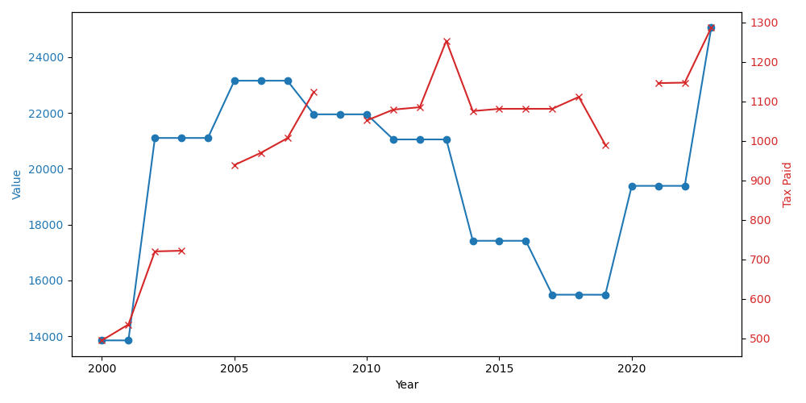

## Tax Evolution Analysis

The tax history presents a detailed progression of property taxes over a span of 25 years, from 1997 to 2023, which I will discuss based on detected patterns and notable changes in this tax timeline.

## Initial Period (1997-2000)

For the year 1997, **taxes paid were $495.20** with a property value of $13,853. There was significant tax and property valuation stability since the tax increase rate and value increase rate remained at 0. By 2000, the tax paid increased to $720.28, corresponding to a property value of $21,102, marked by high value and tax increases in 2000 of **52.33% and 34.52% respectively**, indicating an evident spike during this period.

## Mid-Term Stability (2001-2005)

Throughout 2001 to 2004, taxes saw gradual increases, dominated by moderate or zero increments. For instance, in 2004, **a tax enhancement of 8.13%** brought the amount to **$535.46**. This modest increment suggests a period of stability both in terms of assessment value and tax imposed.

## Period of Decline and Recovery (2005-2010)

In this period, fluctuations were prominent. Notably, in 2006 and 2009, a decline in the property value was observed, accounting for **0.052% and 0.041% reduction respectively**. In 2007, however, there was a moderate recovery with a tax amount of **$1,051.50**. The fluctuations suggest market conditions affecting both property values and subsequent taxes.

## Recent Years Progressive Increase (2018-2023)

Starting from 2018, there's a recurrent pattern of tax and value increases that becomes more pronounced in recent years. In 2020, a substantial value increase rate of **25.17%** occurred, though taxes did not see a correlated increase at the same rate, suggesting taxation policy changes or valuation reassessments.

By the year 2023, taxes increased to **$1,286** from **$1,147.16 in 2022**, which is a tax increase rate of **12.10%**, paired with a property value of **$25,050** experiencing a surge of **29.21%**. This reflects notable appreciation in property value, alongside increased tax commitment.

## Risks and Patterns

1. **Volatility in Tax Rates**: There are periods where property value appreciation doesn't correspond with tax rate adjustments. This can lead to unpredictability in future tax liabilities.
  
2. **Major Boom in Recent Years**: The recent years have shown rapid increases both in property value and tax paid. From 2022-2023 alone, there's a marked increase of **12.10% in taxes** and **29.21% in value**, which could imply potential vulnerability to market corrections.

3. **Lack of Data in Certain Yeas**: Missing tax information in certain years (such as 2006) might indicate either policy shifts or recording inconsistencies, raising concerns about long-term predictability based on historical data.

In conclusion, the tax history shows periods of stability along with those marked by significant fluctuations, especially notable in recent years. Investors should be mindful of this volatility and potential risks with rapid value and tax increases, especially considering long-term investment strategies and potential tax changes in response to market forces.

Below is a chart showing the evolution of the paid tax and assessed value of the property over history (sourced from Zillow)

